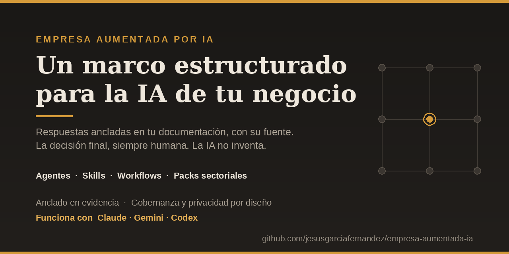
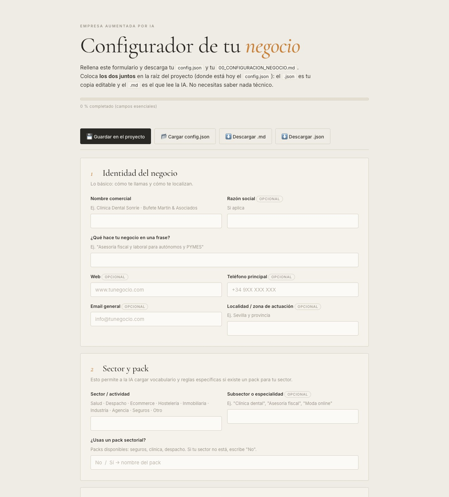

# Empresa Aumentada por IA 🚀

**Un marco estructurado para llevar la IA a tu negocio con método — no a base de copiar y pegar en un chat.**

Agentes especializados, *skills* y flujos de trabajo que responden **anclados en la documentación real
de tu negocio**, citando la fuente y dejando la decisión final en manos humanas. Multisectorial y
agnóstico: el mismo sistema sobre **Claude, Gemini o Codex**.

[Cómo empezar](#-cómo-empezar) · [Estructura](#-estructura-del-entorno) · [Ejemplos](#-ejemplos-de-uso) · [Packs sectoriales](#-packs-sectoriales) · [Contribuir](CONTRIBUTING.md)

---

  

## 💡 El problema

La mayoría usa la IA a ciegas: pegando contexto en un chat, sin método, con respuestas que a veces se
inventan datos y que se pierden en cuanto cierras la ventana. Funciona para jugar, no para operar un
negocio. Falta lo de siempre: **estructura, trazabilidad y control.**

## 🎯 La propuesta

**Empresa Aumentada por IA** convierte el conocimiento disperso de tu negocio —procedimientos,
catálogos, normativa, casos— en una **capa de IA estructurada y gobernada**: cualquier persona del
equipo pregunta en lenguaje natural y recibe respuestas **ancladas en tus documentos**, con la fuente
citada. Si algo no consta, lo dice. La IA **nunca inventa** y **nunca sustituye** el criterio humano.
No es una colección de *prompts*: es un sistema con agentes, *skills* y flujos reutilizables.

## ✨ Por qué es diferente

- **Anclado en evidencia, no en suposiciones.** Responde solo desde tu documentación y cita de dónde
  sale cada afirmación; ante una laguna, responde "no consta" en lugar de improvisar.
- **Arquitectura, no prompts sueltos.** Un Agente Director + 8 especialistas, *skills* y *workflows*
  estandarizados que puedes inspeccionar, versionar y reutilizar.
- **Multisectorial de serie.** Packs listos para **seguros, clínica y despacho**; o adáptalo al tuyo
  con tu configuración y tu documentación.
- **Agnóstico de herramienta.** El mismo sistema sobre Claude, Gemini o Codex. Sin *lock-in*.
- **Gobernanza y privacidad por diseño.** Líneas rojas explícitas, revisión humana obligatoria y
  principio de datos mínimos.
- **Tuyo y portable.** Todo son archivos Markdown legibles, sin dependencias ni cajas negras.

## 👥 ¿Para quién es?

Para quien **ya usa la IA y quiere dar el salto** del uso improvisado a un sistema fiable y repetible:
fundadores, consultores, responsables de operaciones y profesionales de despachos, clínicas,
corredurías, ecommerce o industria. No necesitas programar para usarlo, pero detrás hay una
arquitectura seria que puedes adaptar y extender hasta donde quieras.

## 🎬 Un vistazo al configurador

Personaliza el sistema a tu negocio con un **formulario visual** (o por chat), sin tocar código.
Rellenas las secciones, ves avanzar el progreso y descargas tu configuración lista para la IA:

  
   
  <a href="assets/empresa-aumentada.jpg">Ver el formulario completo →</a>

## 🚀 Cómo Empezar

1. **Carga el Entorno:** Abre esta carpeta como *Workspace/Proyecto* en tu asistente de IA. El archivo de arranque (`CLAUDE.md` / `GEMINI.md` / `AGENTS.md`) hace que el sistema se cargue solo.
2. **Configura tu negocio:** dos opciones, la que prefieras:
   - **Por chat:** escribe *"Ayúdame a configurar mi negocio"* y la IA te hará una entrevista guiada que rellena `00_CONFIGURACION_NEGOCIO.md` por ti.
   - **Por formulario visual:** entra en la carpeta `configurador/` y abre `configurador.html` (o ejecuta el lanzador `Iniciar configurador`) y rellena los campos. Guía completa en `configurador/CONFIGURADOR_LEEME.md`.
3. **¿Hay pack para tu sector?** Si en `packs/` existe tu sector, la IA te lo propondrá para arrancar con material y reglas específicas. Si no, funciona igual en modo genérico.
4. **Prueba las Demos:** Copia los prompts de `demo/prompts_demo.md` en el chat para ver cómo funciona.
5. **Sube tu Información:** En `conocimiento/`, lee el `_LEEME.md` de cada subcarpeta. Cuando subas algo, pídele a la IA *"crea su ficha en el índice documental"*.

## 📂 Estructura del Entorno

- **Archivos de arranque** (`CLAUDE.md`, `GEMINI.md`, `AGENTS.md`): cargan el sistema automáticamente según tu herramienta. No tienes que tocarlos.
- `00_CONFIGURACION_NEGOCIO.md`: **(¡Empieza aquí!)** Formulario para personalizar el sistema con tu negocio.
- `instruccion.md`: El "cerebro" del sistema. Define cómo debe comportarse la IA.
- `conocimiento/`: **(¡Tu zona de trabajo!)** Aquí subes tus manuales, catálogos, plantillas y normativa. Cada subcarpeta tiene un `_LEEME.md` que te guía.
- `agentes/`: Definiciones del Director + 8 especialistas funcionales.
- `skills/`: Habilidades de la IA en formato `SKILL.md` (búsqueda, análisis, comparación, onboarding…).
- `workflows/`: Flujos de trabajo estandarizados para tareas comunes.
- `plantillas/`: Formatos de respuesta predefinidos.
- `packs/`: Paquetes sectoriales opcionales. Incluidos: **seguros**, **clínica** y **despacho** (puedes crear más).
- `demo/`: Ejemplos y prompts para probar el sistema.
- `configurador/`: El formulario visual y su lanzador (`configurador.html`, `servidor.py`, lanzadores y `CONFIGURADOR_LEEME.md`). Genera el `00_CONFIGURACION_NEGOCIO.md` de la raíz.
- `documentacion/`: Guías del sistema (`GUIA_DE_INICIO.md`, `ARQUITECTURA.md`, `FAQ.md`, `GUIA_PRIVACIDAD_DATOS.md`, `CHANGELOG.md`) y las guías para adaptar a tu negocio.

## 📦 Packs sectoriales

Un pack aporta vocabulario, líneas rojas y ejemplos propios de un sector para arrancar más rápido.
Incluidos de serie: **`seguros`**, **`clinica`** y **`despacho`**. ¿Falta el tuyo?
[Propón un pack nuevo](CONTRIBUTING.md) — es la contribución más valiosa al proyecto.

## 💬 Ejemplos de Uso (sea cual sea tu sector)

- *"Tengo un cliente con una incidencia. ¿Qué debo pedirle y qué pasos sigo?"*
- *"Voy a visitar a un cliente nuevo. ¿Qué necesidades clave debo revisar y qué le propongo?"*
- *"Compara las opciones de servicio que tenemos en la carpeta de catálogo."*
- *"Redacta un email disculpándote por un retraso, con tacto y sin prometer de más."*

## 🤝 Contribuir

Las aportaciones son bienvenidas, sobre todo **nuevos packs sectoriales**. Lee la
[guía de contribución](CONTRIBUTING.md) y el [código de conducta](CODE_OF_CONDUCT.md).

## 📄 Licencia

Publicado bajo **[CC BY-NC-SA 4.0](LICENSE)**: uso libre **no comercial** citando la fuente
(Jesús García Fernández). Para **uso comercial**, [contacta](mailto:contacto@jesusgarciafernandez.com).

---

🇬🇧 <strong>English summary</strong>

**Empresa Aumentada por IA** ("AI-Augmented Business") is a structured framework that puts AI to work
on your business's own knowledge — agents, skills, workflows and sector packs — powered by Claude,
Gemini or Codex. It is **multi-sector**: a clinic, a law firm, an online shop or an insurance brokerage adapt
it through their own configuration, their own documents, and optional **sector packs** (`packs/`).
The AI always grounds answers in *your* documentation, cites sources, never makes things up, and
never replaces human judgment. Content is in Spanish. Licensed under CC BY-NC-SA 4.0 — free for
non-commercial use with attribution; contact the author for commercial licensing.

---

<em>La inteligencia artificial no sustituye el conocimiento de tu negocio: lo organiza, lo hace
accesible y lo convierte en apoyo práctico para que las personas trabajen mejor.</em>  
Creado por <a href="https://jesusgarciafernandez.com">Jesús García Fernández</a>

