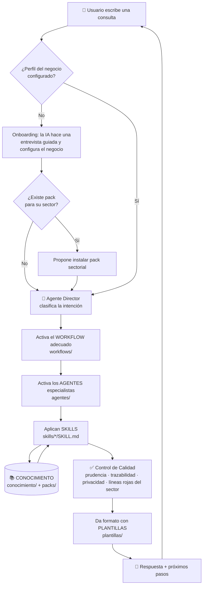

# 🧭 Cómo funciona la Empresa Aumentada (arquitectura)

Este documento explica, de forma visual, **cómo viaja una consulta** por el sistema. No necesitas
entenderlo para usarlo, pero ayuda a ver por qué las respuestas son fiables y prudentes.

## La idea en una frase
> Tú escribes en lenguaje natural → un **Director** entiende qué necesitas → activa a los
> **agentes especialistas** y el **flujo** adecuado → ellos usan **skills** sobre tu
> **conocimiento** real → se revisa la **calidad** → recibes una respuesta con próximos pasos.

## Diagrama del flujo

## Las piezas
| Pieza | Carpeta | Qué hace |
|---|---|---|
| **Configuración** | `00_CONFIGURACION_NEGOCIO.md` | Personaliza el sistema con tu negocio. |
| **Cerebro** | `instruccion.md` | Reglas maestras, principios y líneas rojas (universales + de pack). |
| **Director** | `agentes/agente_director.md` | Entiende la consulta y reparte el trabajo. |
| **Especialistas** | `agentes/` | Director + 8 agentes funcionales (conocimiento, producto, incidencias, atención, comercial, diagnóstico, formación, cumplimiento). |
| **Skills** | `skills/<nombre>/SKILL.md` | Habilidades concretas (buscar, comparar, redactar, onboarding, ingesta…). |
| **Flujos** | `workflows/` | Pasos estandarizados para tareas comunes. |
| **Conocimiento** | `conocimiento/` | La documentación real de tu negocio (fuente de verdad). |
| **Packs** | `packs/` | Material y líneas rojas específicos de un sector (opcional). |
| **Plantillas** | `plantillas/` | Formatos de salida (correos, informes, checklists). |
| **Guardarraíles** | Control de Calidad + Privacidad | Aseguran prudencia y protección de datos. |

## Por qué es fiable
1. **Todo se basa en tu documentación.** Si no hay documento, la IA lo dice; no se inventa nada.
2. **Trazabilidad.** Cita de qué documento sale cada respuesta.
3. **Control de calidad.** Antes de entregar respuestas sensibles, revisa que no haya promesas falsas
   ni datos personales innecesarios, y respeta las líneas rojas del sector.
4. **Revisión humana.** La decisión final siempre es tuya.

> Si tu herramienta no muestra el diagrama, ábrelo en una que soporte Mermaid. El contenido de la
> tabla explica lo mismo.
